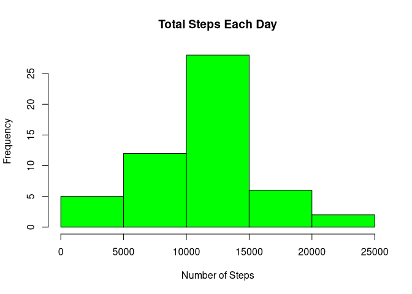
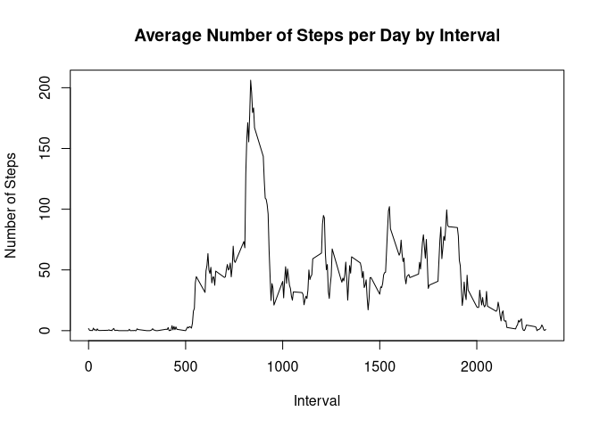
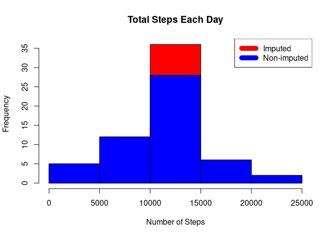
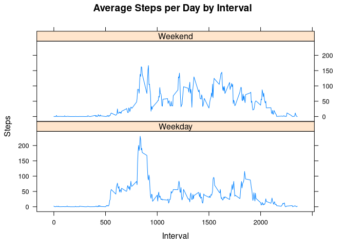

## Loading and preprocessing the data

### Set Global Option

```r
knitr::opts_chunk$set(echo=TRUE)
```
### Load data

```r
if (!file.exists("activity.csv") )
    {
     dlurl <- 'http://d396qusza40orc.cloudfront.net/repdata%2Fdata%2Factivity.zip'  
     download.file(dlurl,destfile='repdata%2Fdata%2Factivity.zip',mode='wb')  
     unzip('repdata%2Fdata%2Factivity.zip')
    }
```
### Read data

```r
data <- read.csv("activity.csv")
```

## What is mean total number of steps taken per day?

```r
steps_per_day <- aggregate(steps ~ date, data, sum)
hist(steps_per_day$steps, main = paste("Total Steps Each Day"), col="green",xlab="Number of Steps")
```

<!-- -->

```r
rmean <- mean(steps_per_day$steps)
rmean
```

```
## [1] 10766.19
```

```r
rmedian <- median(steps_per_day$steps)
rmedian
```

```
## [1] 10765
```
The mean is `10766.19` and the median is `10765`


## What is the average daily activity pattern?

```r
steps_per_interval <- aggregate(steps ~ interval, data, mean)
plot(steps_per_interval$interval,steps_per_interval$steps, type="l", xlab="Interval", ylab="Number of Steps",main="Average Number of Steps per Day by Interval")
```

<!-- -->

```r
max_interval <- steps_per_interval[which.max(steps_per_interval$steps),1]
max_interval
```

```
## [1] 835
```
The interval with most steps is `835`


## Imputing missing values

### Calculate the total number of missing values inside the dataset

```r
TotalNA <- sum(!complete.cases(data))
TotalNA
```

```
## [1] 2304
```
Overall, there are `2304` number of total missing values.

### Compute missing values using Mean for the day

```r
StepsAverage <- aggregate(steps ~ interval, data = data, FUN = mean)
fillNA <- numeric()
for (i in 1:nrow(data)) {
    obs <- data[i, ]
    if (is.na(obs$steps)) {
        steps <- subset(StepsAverage, interval == obs$interval)$steps
    } else {
        steps <- obs$steps
    }
    fillNA <- c(fillNA, steps)
}
```

### Create a new dataset

```r
activity_new <- data
activity_new$steps <- fillNA
```

### Make a histogram of the total number of steps taken each day and Calculate and report the mean and median total number of steps taken per day.

```r
StepsTotalUnion <- aggregate(steps ~ date, data = activity_new, sum, na.rm = TRUE)
hist(StepsTotalUnion$steps, main = paste("Total Steps Each Day"), col="red", xlab="Number of Steps")
#Create Histogram to show difference. 
hist(steps_per_day$steps, main = paste("Total Steps Each Day"), col="blue", xlab="Number of Steps", add=T)
legend("topright", c("Imputed", "Non-imputed"), col=c("red", "blue"), lwd=10)
```

<!-- -->


#### Calculate Mean

```r
meantotal <- mean(StepsTotalUnion$steps)
meantotal
```

```
## [1] 10766.19
```
#### Calculate Median

```r
mediantotal <- median(StepsTotalUnion$steps)
mediantotal
```

```
## [1] 10766.19
```
##### Do these values differ from the estimates from the first part of the assignment? 

```r
mediandiff <- mediantotal - rmedian
mediandiff
```

```
## [1] 1.188679
```

```r
meandiff <- meantotal - rmean
meandiff
```

```
## [1] 0
```
The value of the mean(`Mean Var: 0`) is the same however the median does have a small variance(`Median Var:1.1886792`). between the total which includes the missing values to the base

##### What is the impact of imputing missing data on the estimates of the total daily number of steps?

The missing data has the biggest effect on the 10000 - 150000 step interval and changes frequency from 27.5 to 35 a variance of 7.5


## Are there differences in activity patterns between weekdays and weekends?

```r
weekdays <- c("Monday", "Tuesday", "Wednesday", "Thursday", 
              "Friday")
activity_new$dow = as.factor(ifelse(is.element(weekdays(as.Date(activity_new$date)),weekdays), "Weekday", "Weekend"))
StepsTotalUnion <- aggregate(steps ~ interval + dow, activity_new, mean)
library(lattice)
xyplot(StepsTotalUnion$steps ~ StepsTotalUnion$interval|StepsTotalUnion$dow, main="Average Steps per Day by Interval",xlab="Interval", ylab="Steps",layout=c(1,2), type="l")
```

<!-- -->

